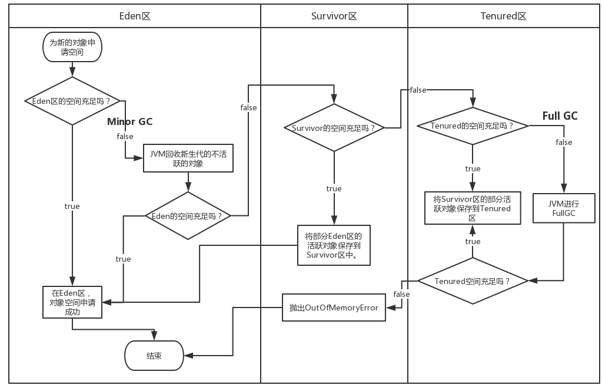

# Android内存相关笔记

## 1. JVM的内存结构(1.7以前的，便于学习)

JVM的内存结构主要分为堆区、栈区以及方法区。这里的堆和栈需要和数据结构里面的堆和栈区分开。他们分别有不同的作用。

### 1.1 堆内存

堆区是jvm的内存结构中最大的一块，一般用于存放代码中生成的对象。堆区的内存一般由jvm自动分配，和自动回收。所以GC回收主要也就是回收堆区中存放的无用的对象。堆区是内存共享的，所有的对象实例以及数组都需要在堆上分配内存。
其中还能分得更细一些，堆内存中还分为年轻代和老年代，年轻代下面还分Eden，FromSurvivor和ToSurvivor，如果在堆中没有完成实例分配，并且再也无法扩展时，就会抛出OutOfMemoryError异常。

### 1.2 栈内存(虚拟机栈)

每个线程都有自己私有的栈。每个线程的方法的调用又会在自己的栈中创建一个栈帧。在方法栈中会存放编译期可知的各种基本数据类型(boolean、byte、char、short、int、float、long、double)，对象的引用(对象本身都存放在堆区)。每一个方法被调用直至执行完成的过程，就对应着一个栈帧在虚拟机栈中从入栈到出栈的过程。 

### 1.3 程序计数器

程序计数器所占的空间比较小，作用可以看做当前线程所执行的字节码行号的指示器。由于java虚拟机的多线程是通过多线程的轮流切换并分配处理器的执行时间来实现的，在任何一个确定的时刻，一个处理器只会执行一条线程中的指令。因此为了线程切换之后能够恢复到正确的的执行位置，每个线程需要一个独立的程序计数器，各条线程之间的计数器互不影响，程序计数器也是线程私有的内存。
如果一个线程执行的是一个Java方法，那么计数器上就记录的是正在执行的虚拟机字节码指令的地址。如果正在执行的是Native方法，那么这个计数器的值为Undefined。

### 1.4 方法区(永久代) java1.7及以前

方法区与Java堆一样，是各个内存共享的内存区域，它用于存储已经被虚拟机加载的类信息、常量、静态变量、即时编译器编译后的代码等等。

### 1.5 本地方法栈

Native Method Stack，作用与虚拟机栈相似，虚拟机栈是虚拟机为了执行Java方法服务，本地方法栈是为虚拟机使用的Native方法服务。虚拟机规范中对本地方法栈中的方法使用的语言、使用方式与数据结构并没有强制规定，因此具体的虚拟机可以自由实现它。甚至有的虚拟机（譬如Sun HotSpot虚拟机）直接就把本地方法栈和虚拟机栈合二为一。与虚拟机栈一样，本地方法栈区域也会抛出StackOverflowError和OutOfMemoryError异常。

下面张图能够说明如何通过参数来控制各个区域的内存大小：


控制参数：

- Xms：设置堆的最小空间大小
- Xmx：设置堆的最大空间大小
- XX:NewSize 设置新生代最小空间大小
- XX:MaxNewSize 设置新生代最大空间大小
- XX:PermSize  设置永久代最小空间大小
- XX:MaxPermSize 设置永久代最大空间大小
- Xss:设置每个线程的堆栈大小

这里没有直接设置老年代的参数是因为直接用堆大小减去年轻代大小就是老年代大小。

## 2. GC 垃圾收集器

jvm中程序计数器、虚拟机栈以及本地方法栈随着线程的销毁，栈帧的入栈出栈，也会自动进行回收。而在堆中(以及方法区中)的内存则需要垃圾回收机制来进行管理。

### 2.1 对象存活的判断

堆中的对象需要首先判断是否还存活，之后是否还需要用到，才能决定要不要回收这个对象占用的内存。一般有两种方法进行判断：
- **引用计数：** 每个对象都有一个引用计数器，每新增一个引用计数＋1，每释放一个引用计数-1，当计数为0的时候，就可以进行回收。但是存在对象之间相互循环引用的问题。
- **可达性分析：** 从GC Roots开始向下搜索，搜索走过的路径称为引用链。当一个对象到GC Roots没有任何的引用链相连时，那么这个对象是不可达对象。此时的对象就可以进行回收。

**哪些对象可以作为GC Roots呢？**
虚拟机栈中引用的对象。
方法区中静态属性实体引用的对象。
方法区中常量引用的对象。
本地方法栈中JNI引用的对象。

### 2.2 垃圾收集算法

目前已经有很多垃圾收集算法可以用于GC

#### 2.2.1 标记清除算法

Mark-Sweep算法分为两个步骤，首先标记出所有可以访问到的还有用的对象，然后在“清除”阶段统一清除掉没有标记的对象。标记清除法是最基础的回收算法。
**缺点：** 1. 效率低下。标记和清除的效率都较低。2. 内存碎片化，在标记-清除后，会产生大量的不连续内存碎片，不利于后续的程序运行。碎片过多可能会导致找不到连续的大块内存存放新的内存而提前触发下一次GC。

#### 2.2.2 复制算法

Copying算法将可用的内存分为大小相同的两块，每次只使用其中一块。当这一块内存用完了，就将还存活的对象移动到另一块内存中去，并回收这一半的内存。这样子回收时只需要清除掉一整块内存即可，同时也避免了内存碎片化的问题。
**缺点：** 可用内存仅为原来的一般，而且持续复制长时间生存的对象也降低了效率。

#### 2.2.3 标记压缩算法

Mark-Compact算法为了避免复制算法的缺点以及空间浪费过度，“标记”的过程仍然和标记清楚算法一样，但是后续步骤是让所有存活的对象向一端移动，然后直接清理掉边界以外的内存，这样子既避免了内存碎片化，又避免了一半的空间浪费。

#### 2.2.4 分代的收集算法

分代的收集算法的前提是大部分的对象生命周期都比较短暂。
把Java的堆内存分为；了新生代和年老代，根据不同的分区采用更适合的不同的收集算法。在新生代中，每次垃圾手机都会有大批的无用对象被回收，只有少量的存活，所以采用复制算法较好，只需复制出少量的存活对象即可。而老年代中对象的存活率高，则需要使用标记清除算法或者是标记压缩算法来进行回收。

### 2.3 GC流程

堆内存被分为新生代和年老代(Tenured)，其中新生代又被分为Eden区和Survivor区，Survivor区又被平均分为FromSurvivor和ToSurvivor区。整个的GC流程基础如下：

1. 新产生了一个对象，开始申请这个对象的内存空间。
2. 首先判断新生代的Eden区还有没有足够的空间，如果有放入，如果没有则执行一个MinorGC，回收Eden中的内存，再判断是否足够，如果足够则放入Eden中。
3. 如果MonorGC之后还是不够空间那么就会对Survivor区进行判断，如果Survivor区还有足够的空间，则将Eden中部分活跃的对象保存在Survivor区中，随后继续判断Eden区中是否有足够的空间，如果充足，则在Eden区进行新对象的内存分配。
4. 如果此时存活区中也没有了充足的空间，那么就会继续去判断年老区，如果此时年老区空间充足，则将Survivor区的活跃对象保存在年老区中，之后Survivor区就会出现空余空间，随后再将Eden区的活跃对象保存在存活区中，再在Eden区中开辟新内存空间。
5. 如果此时年老区也满了，那么就会触发一次Major GC也就是Full GC，进行年老代的内存清理。如果年老代进行了内存清理还是不够位置，那么就会产生OOM异常。

下面就是GC的流程示意图：


### 2.3 两个Survivor区

- **为什么需要survivor区的存在：** 因为如果没有survivor区的话，一遍新生代的GC之后，全部存活的对象全部进入年老代，这样子很快就会满了。而年老代比较大，一次GC花费的时间比较长，如果年老代GC的频率又很快的话，性能会非常的糟糕，所以需要一个survivor区作为缓冲，将寿命中等的对象尽量在Survivor区就被回收了 ，减少年老代GC的次数。

- **为什么有两个Survivor区：** 目前的新生代的回收算法使用的是复制算法。两个Survivor区，一个是在Minor GC完后，用来保存eden以及FromSurvivor区存活的对象。另一个Survivor区以及Eden上面的空间就会被清除干净。在这样子的一次复制清除后，FromSurvivor和ToSurvivor之间会互换身份。一般保持Eden区和两个Survivor区的比例为8:1:1。

### 3. OutOfMemory异常

#### 3.1 出现场景

- **堆溢出：** 堆一般是用来存储对象的，如果新的对象产生了，如果进行了Full GC后还没有办法找足够的空间为其分配内存，达到了堆的最大内存限制，那么就会抛出OOM异常。异常信息为
``java.lang.OutOfMemoryError：java heap space``

- **栈溢出：** 在java中有虚拟机栈和本地方法栈，

    **虚拟机栈中：** 
    1. 如果线程请求的最大栈深度大于虚拟机所允许的最大深度，就会抛出StackOverFlowError。
    2. 如果虚拟机在扩展栈的时候无法申请足够的内存空间，就会抛出OutOfMemoryError。当线程过多时可能会导致这个异常。

- `java.lang.OutOfMemoryError:GC overhead limit exceeded` 当内存回收的效果很差时，会抛出这个异常，比如花费了98%的时间只回收了不到2%的堆内存时候，就被出错。

- `java.lang.OutOfMemoryError:Metaspace` 在java1.8以后，永久代中部分进入元数据区部分进入堆区。其中如果加载的类的数量过多或者类声明的大小过大，导致metaspace区不够用。就会抛出这个错误。

- `java.lang.OutOfMemoryError:Unable to create new native thread` 当出现这个错误的时候，说明java应用程序已经达到了可以启动的最大线程数量了。

- `java.lang.OutOfMemoryError:Out of swap space` java应用程序在启动的时候会指定所需要的内存大小，可以通过-Xmx参数指定。当jvm请求的总内存大小大于可用的物理内存的情况下，操作系统会将部分内存中的数据交换到虚拟内存上去。Out of swap space表示交换空间也已经耗尽，分配内存失败。

- `java.lang.OutOfMemoryError:Requested array size exceeds VM limit` java中的索引是int类型，如果创建的数组长度超过了java虚拟机最大可以支持的数组，就会抛出这个错误。

#### 3.2 Android中的OutOfMemory异常

##### 3.2.1 获取手机的内存配置

```java
Runtime.getRuntime().maxMemory();//单个应用的最大内存堆大小，如果设置了largeSize那么就得是heapsize
Runtime.getRuntime().freeMemory();//返回目前虚拟机的空闲内存大小，GC后这个数字可能会变大。
Runtime.getRuntime().totalMemory();//返回虚拟机目前可使用的内存大小
Integer.toString(activityManager.getMemoryClass());//最大内存堆的大小。
Integer.toString(activityManager.getLargeMemoryClass());//heapSize的大小。
```

##### 3.2.2 Android中常见OutOfMemory原因

- **图片处理时：** 在Android中，最容易出现OOM的地方往往就是图片处理的时候。我们在Android中处理图片的时候，常常将图片作为Bitmap来处理。Bitmap分为两个部分，一部分为bitmap对象，用于存储这个图片的长宽、透明度等信息。另一部分就为bitmap的数据，用于存储bitmap的字节数据。在android 2.3.3以前存在native内存中，GC无法涉及。所以在我们需要调用bitmap的recycle方法来告诉系统，这里的内存可以回收了。在3.0之后，两部分都存放于堆中，也就可以GC了，此时我们可以使用软引用，确保内存不足时候能够成功回收。
    那么在3.0之后，可以使用BitmapFactory.Options.inBitmap方法来设置一个可以复用的Bitmap，在之后新的Bitmap大小相同就可以直接复用这块内存，而不需要重新分配，4.4之后不同大小的Bitmap也可以复用内存。如果要显示的图片并不大，那么就不需要全部加载，而是可以设置一个采样率，减少图片占用的内存。
- **未关闭InputStream或者OutputStream** 操作完输入输出流之后应该关闭流。
- **调用registerReceiver后未调用unregisterReceiver** 这两个方法应该成对出现，重写Activity的onDestroy回调完成广播的动态注销。
- **未手动关闭cursor** 在查询数据库后，Android中使用cursor进行管理，查询数据量大的时候，如果没有手动的释放cursor，可能会导致OOM异常。
- **内存泄漏：** 除去处理一些大资源，比如图片视频等时候容易造成OOM异常，我们在编写代码的时候不规范，或者不注意，导致的内存泄漏造成GC无法有效地回收无用的对象，新的对象没有足够的堆空间分配，也会导致OOM错误，下面就会介绍Android常见的内存泄漏场景。

### 4. 内存泄漏

内存泄漏往往是编程时候没有注意对象的生命周期等问题导致的。对象在应该回收的时候却还有引用，造成GC无法回收，导致内存不够。

#### 4.1 static关键字造成
一个类中的变量如果被标注为static，那么这个变量就属于这个类。静态的变量访问很方便，直接通过类名就可以。如果使用静态的变量来引用资源耗费过多的实例，就会导致这个实例对象的内存无法释放，最后导致内存泄漏甚至内存溢出。比如：
```java
private static Context mContext = activity；
```
这样子后面的activity的内存就一直不能释放了。或者静态变量的间接调用也会导致内存泄漏

**解决方法：** 
1. 尽量避免static成员变量引用资源耗费过多的实例，比如Context，包括间接引用。
2. Context的赋值尽量使用Application Context，因为Application的Context生命周期比较长。
3. 使用弱引用WeakReference代替强引用。WeakReference<Context> mContextRef;

#### 4.2 内部类造成的内存泄漏

如果在Activity中定义一个内部类，如果一个AsyncTask或者新的Thread，那么作为这个Activity的内部类就会持有外部Activity的一个引用，当初始化一个Thread或者内部类，然后开始执行后并且还未执行完的时候，如果Activity已经被退出，因为这个子线程内部类持有Activity的引用，那么这个Activity不会被回收。类似于内部类Handler的延时post造成的内存泄漏问题。同理，AsyncTask也不适合作为内部类使用。因为作为内部类的AsyncTask内部视同ThreadPoolExecutor实现的，线程池产生的Thread生命周期更加不确定，所以建议不要吧AsyncTask作为内部类使用。

**解决方法：** 将线程的内部类作为静态内部类使用。并且在线程或者内部类的内部采用弱引用来保存Context的引用。

#### 4.3 单例模式造成内存泄漏

使用单例模式希望的是全局只有一个静态变量，如果我们传入了activity的上下文的话，如果，因为单例模式还始终持有这个上下文的引用，会导致activity回收失败。

**解决方法：** 使用Application的context，这样子就避免了传入Activity造成内存泄漏。

#### 4.4 mvp框架中的内存泄漏

一般来说mvp框架中的Presenter层持有View的接口对象，model也可能持有Presenter层的引用。当Activity销毁时，model如果还在获取数据。Presenter也就会一直持有着View的对象。导致activity不能正常回收。

**解决方法：** 
1. 在Activity的onDestroy回调方法中利用Presenter层进行资源的释放，解除与View层的绑定，并且取消model层未完成的请求。最后置空presenter层。
2. 将Presenter层转化为弱引用区引用view对象。

#### 4.5 timer和timertask（属性动画）引起的内存泄漏
因为我们通常会用来做一些计时操作或者循环操作，如果忘记销毁变量的话，那么timer或者timertask可能会一直持有着activity或者其他变量，造成内存泄漏。

**解决方法：** 在适当的时机调用cancel方法，比如在activity的onDestroy方法里面调用cancel方法。

## 5. Android 内存优化

### 5.1 JIT和AOT模式

JIT(Just In Time)模式说明的是说每次在打开App的时候，将App的dex代码转换成原生指令码，以减少在运行app的时候才去进行转换，降低效率。但是一些代码运行次数很少，这样子每次打开App编译都会花时间，这样子也很浪费时间。
而AOT(Ahead Of Time)模式则是说把这个转换的时间放在了App安装的时候。这样子只需要一次编译，后续的运行就不用花时间编译了。但是这样子会导致App的安装时间变长，并且App占用的存储空间也会变大。目前的Android虚拟机4.4以后使用的都是Art虚拟机，也就是采用了AOT模式。

### 5.2 内存抖动问题

内存的大小不断浮动。
主要原因是大量而且临时的小对象不断的频繁创建，导致程序频繁得分配内存，GC频繁回收内存。而GC频繁回收内存会导致卡顿，甚至内存溢出。
因为大量、临时的小对象被创建回收，会导致内存碎片，当需要分配内存的时候，可能总体足够，可是找不到整块的连续内存，会视为内存不足，导致OOM。

**解决方法：** 尽量避免创建大量、临时的小内存。

### 5.3 代码优化

1. 减少不必要的类、对象以及功能库带来的内存开销。
2. 减少数据的体积大小，比如通过序列化数据减少，比如Protocol Buffer。慎用SharePreference，因为有时为了读取一个数据，会将整个XML文件读进内存中。
3. 使用占用内存更小的数据结构，比如Android中独有的ArrayMap取代Java中的HashMap。
4. 使用占用内存更小的数据类型，比如尽量避免使用枚举变量，因为枚举类型占用的内存更大。
5. 数据对象的引用应该根据不同的场景，选择不同的引用(强引用，软引用，弱引用，虚引用)。

### 5.4 不同种引用的区别

- **强引用：** 我们使用new关键字创建出来的对象就是强引用。比如：`Object ob = new Object();`。强引用指向的对象不会GC回收，虚拟机宁愿抛出OOM也不会回收还有强引用的对象。
- **软引用：** 如果一个对象只有软引用，那么如果内存空间充足，GC不会回收这个对象，如果此时内存不足，GC就会回收这个对象。只要GC没有回收这个内存，这个对象就可以被程序使用。**软引用可以实现对内存敏感的高速缓存，并且可以和一个引用队列联合使用，如果软引用中指向的对象被GC回收了，虚拟机就会把这个软引用加入到与之关联的引用队列中去。**
- **弱引用：** 如果一个对象只具有弱引用，那么GC只要扫描到这个对象，就会回收它的内存。不过由于GC的优先级并不高，所以一般也不是立即会被回收掉。**同样的弱引用也可以配合引用队列进行使用，在被回收时候将这个引用添加到与之关联的引用队列中去。**
- **虚引用：** 虚引用并不会决定对象的生命周期，如果一个对象只有虚引用，那么就和没有任何引用一样，随时都可能会被回收。虚引用必须要和引用队列一起使用。


### 5.5 使用工具检测内存泄漏

可以使用LeakCanary，官网如下
https://square.github.io/leakcanary
按照操作指引，在module中添加以下即可。
```java
dependencies {
  // debugImplementation because LeakCanary should only run in debug builds.
  debugImplementation 'com.squareup.leakcanary:leakcanary-android:2.0-beta-3'
}
```
然后在build-editBuildType中改为debug模式即可，安装后就能够通过查看leaks的报告发现内存泄漏。


