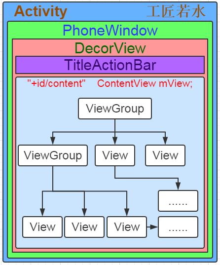
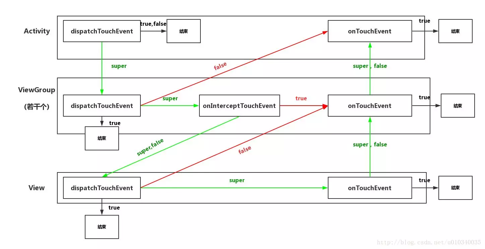

# View的学习笔记

一般来说，View和ViewGroup在Android中就承担着展示和交互的作用。屏幕显示的，用户点击的，都是View或者ViewGroup。那么Android是如何设计这个系统，让手机可以准确的知道用户点击的是哪一个View，如何准确稳定的在各种不同屏幕尺寸形状的设备上一致地显示出来。这就需要知道关于View的绘制流程以及View的事件分发机制。

## 1. View的事件分发机制
View在Android中承担了与用户交互的作用。那么View是如何确切的知道用户的点击在哪一个View中，想要与具体的哪一个View交互呢，这些都与View的事件分发机制有关。

### 1.1  Activity中的View树
一个Activity里面包含一个Window对象，Window对象是由PhoneWindow来实现的。PhoneWindow将整个DecorView(这是一个ViewGroup)作为整个应用窗口的根View。DecorView又分为上下两个部分，分别是TitleView以及ContentView，下面的这个ContentView就是我们应用要展示的区域，Activity中需要绑定的View就是这个ContentView。
再往下就是我们自己定义的View树了，我们添加进去的View是一颗树的结构，里面由ViewGroup和View组成，ViewGroup下面能有一个或者多个View，其结构如下图所示。(ViewGroup也是继承自View，也就是说Android中所有拿来显示的东西都是继承自View，他们公用一套机制)


### 1.2 MotionEvent

用户的每一次触摸操作会有一个或者多个MotionEvent，主要有以下三种：

- ACTION_DOWN   手指刚接触屏幕
- ACTION_MOVE   手指在屏幕上移动
(超过TouchSlop常量距离才会被系统检测到，这个常量与设备有关，通过View.Configuration.get(getContext()).getScaledTouchSlop()可以获取)。
- ACTION_UP     手指从屏幕一开的一瞬间

一般来说用户的每一次操作会产生一次DOWN，一次UP以及0次，一次或者多次MOVE。
通过MotionEvent对象我们可以获取到点击事件发生的x和y坐标。系统提供了两种方法getX/getY和getRawX/getRawY来获取坐标。getX/getY表示的是相对于当前View左上角的x和y，而getRawX/getRawY表示的是相对于手机屏幕左上角的x和y坐标。
一般来说，屏幕上x和y坐标是相对于物体左上角的，x轴指向于正右，y轴指向于正下。

### 1.3 事件传递的三个阶段
View的事件传递传递的实际上就是MotionEvent事件，当一个MotionEvent事件产生之后，系统需要将这个事件传递给具体的View，而这个View需要时我们希望的View。这个传递的过程就是事件分发过程。这个传递过程一般分为三个阶段，分别是分发、拦截以及消费，这个三个过程分别对应三个不同的方法。

在《Android开发艺术探索》这本书中，总结的三个方法的伪代码关系如下(这个是ViewGroup中的方法总结)：
```java
public boolean dispathTouchEvent(MotionEvent ev){
    boolean consume = false;
    if (onInterceptTouchEvent(ev)){
        consume = onTouchEvent(ev);
    }else{
        consume = child.dispatchTouchEvent(ev);
    }
    return consume;
}
```

- **分发(dispatchTouchEvent)：** 方法返回值为true意思为event被当前的视图被消费掉了
- **拦截(onIterceptTouchEvent)：** 方法返回值为true表示拦截这个事件给自己的onTouchEvent方法消费，如果不为true则继续调用子view的dispatchTouchEvent来进行分发。**(View没有这个方法，只有ViewGroup有这个方法。一旦有事件传递给他，它的onTouchEvent方法就会被调用。)**
- **消费(onTouchEvent)：** 方法返回true则表示当前viw可以处理对应的事件，返回值为false则表示当前view不处理这个事件，会往上传递给父view的onTouchEvent方法处理。 

根据上述的伪代码以及方法介绍，一个根ViewGroup事件分发的大致规则是：事件产生之后先传递给它，然后调用`dispatchTouchEvent`。如果ViewGroup的`onInterceptTouchEvent`方法返回true，就表示要拦截当前的事件，接着这个事件就交给这个ViewGroup处理，此时调用这个View的`onTouchEvent`；如果这个ViewGroup返回的`onInterceptTouchEvent`方法返回的false，那么表示自己不处理这个事件，那么这个事件就会传递给子View，接着调用子View的`dispatchTouchEvent`方法，如此传递，直到事件被处理。
而根据前面的方法解释，如果这个这个事件给到一个View或者ViewGroup处理，也有可能`onTouchEvent`返回false，那么父View的onTouchEvent就会被调用。

### 1.4 事件传递的流程
前面有说到事件的分发是从Activity开始，具体操作由Window完成，传递给到根View的。事件从Activity的`dispatchTouchEvent`到Window的`superDispatchTouchEvent`，再直接调用DecorView的`superDispatchTouchEvent`。此时的DecorView就是一个顶级View，也是就是一个ViewGroup。
那么在ViewGroup中，要使用`dispatchTouchEvent`进行事件分发，这个方法的部分源码如下。
```java
// Check for interception.
    final boolean intercepted;
    if (actionMasked == MotionEvent.ACTION_DOWN
            || mFirstTouchTarget != null) {
        final boolean disallowIntercept = (mGroupFlags & FLAG_DISALLOW_INTERCEPT) != 0;
        if (!disallowIntercept) {//表示可以判断拦截事件。
            intercepted = onInterceptTouchEvent(ev);
            ev.setAction(action); // restore action in case it was changed
        } else {//不能判断是否拦截事件，置为false不拦截。
            intercepted = false;
        }
    } else {
        // There are no touch targets and this action is not an initial down
        // so this view group continues to intercept touches.
        intercepted = true;
    }
```

这里会判断事件是不是`ACTION_DOWN`以及`mFirstTouchTarget != null`来确定是否拦截事件。`mFirstTouchTarget`里面指向的是后续成功处理了这个事件的ViewGroup的子元素。所以一个Touch序列由DOWN开始到来的时候，如果这个ViewGroup拦截了，那么`mFirstTouchTarget = null`，而后面的MOVE事件和UP事件都会被这个ViewGroup拦截下来。
但是这段代码中还有一个`FLAG_DISALLOW_INTERCEPT`标记位，通过`requestDisallowInterceptTouchEvent`方法来设置，一般用于子View中。`FLAG_DISALLOW_INTERCEPT`设置后，ViewGroup就无法拦截`ACTION_DOWN`之外的其他点击事件(`ACTION_DOWN`会重重这个标志位，面对`ACTION_DOWN`事件，ViewGroup总是用`onInterceptTouchEvent`方法来询问自己是否拦截这个事件。子View调用`requestDisallowInterceptTouchEvent`并不能影响ViewGroup对DOWN事件的处理)这个标志位可以用来解决滑动冲突的问题。
由此，一个事件序列只调用一次`onInterceptTouchEvent`，如果某个View决定拦截这个事件序列，那么这个序列剩下的都要传递给它处理，而且`onInterceptTouchEvent`方法不再调用。
**所以如果想要提前处理一个事件序列的所有事件，应该选择`dispatchTouchEvent`来处理，只有这个方法能保证每次都能调用。**

当事件分发到View的`dispatchTouchEvent`
```java
public boolean dispatchTouchEvent(MotionEvent event) {
    ...
    boolean result = false;
    if (onFilterTouchEventForSecurity(event)) {
        ListenerInfo li = mListenerInfo;
        // onTouch方法优先级要高于onTouchEvent(event)方法，如果设置了OnTouchListener
        //那么要看回调的OnTouch方法返回值，如果为false，当前的事件的onTouchEvent方法才会调用
        if (li != null && li.mOnTouchListener != null 
                && (mViewFlags & ENABLED_MASK) == ENABLED 
                && li.mOnTouchListener.onTouch(this, event)) {
            result = true;
        }
        if (!result && onTouchEvent(event)) {
            result == true;
        }
    }
    ...
    return result;
}
```

下面是总的View的事件分发流程图
<!--  -->


如果下面所有的子元素都不处理这个事件，onTouchEvent返回false，那么最终会由Activity来处理这个事件。


### 1.5 滑动冲突处理
一般是在父View和子View嵌套时候，会发生滑动冲突的问题。这个问题可以有两种解决方法。根据不同的滑动策略的需求，来选择合适的方法。

#### 1.5.1 外部拦截法

所有的事件传递都会通过父View才能到达子View，如果父View需要这个事件，那么就不让其进入子View，就能解决滑动冲突的问题，需要重写`onInterceptTouchEvent`方法。
```java

 @Override
    public boolean onInterceptTouchEvent(MotionEvent ev) {
        boolean intercepted = false;
        int x = (int) ev.getX();
        int y = (int) ev.getY();

        switch (ev.getAction()) {
            case MotionEvent.ACTION_DOWN:
                intercepted = false;
                break;
            case MotionEvent.ACTION_MOVE: {
                if (是父View需要的事件) {
                    intercepted = true;
                } else {
                    intercepted = false;
                }
                break;
            }
            case MotionEvent.ACTION_UP: {
                intercepted = false;
                break;
            }
        }
        mLastXIntercept = x;
        mLastYIntercept = y;
        return intercepted;
    }
```
其中，针对ACTION_DOWN事件，父View在这里只能选择不拦截，否则后续所有的MOVE和UP事件只能交给父View处理，子View就收不到事件了。针对不同的动作，我们判断ACTION_MOVE事件是否匹配，如果父容器需要就返回true，如果不需要就返回false。

#### 1.5.2 内部拦截法

内部拦截法的父容器不拦截事件，所有的事件都传递给子View，由子View来判断是否消耗这个事件。需要重写子View的dispatchTouchEvent方法，伪代码如下：
```java
public boolean dispatchTouchEvent(MotionEvent event) {
        int x = (int) event.getX();
        int y = (int) event.getY();

        switch (event.getAction()) {
            case MotionEvent.ACTION_DOWN: {
                parent.requestDisallowInterceptTouchEvent(true);
                //让父容器不拦截DOWN事件
                break;
            }
            case MotionEvent.ACTION_MOVE: {
                int deltaX = x - mLastX;
                int deltaY = y - mLastY;
                if (父容器需要此类点击事件) {
                    //让父容器拦截其他的事件
                    parent.requestDisallowInterceptTouchEvent(false);
                }
                break;
            }
            case MotionEvent.ACTION_UP: {
                break;
            }
            default:
                break;
        }

        mLastX = x;
        mLastY = y;
        return super.dispatchTouchEvent(event);
    }
```
然后再修改父容器的onInterceptTouchEvent方法：
```java
public boolean onInterceptTouchEvent(MotionEvent event) {

        int action = event.getAction();
        if (action == MotionEvent.ACTION_DOWN) {
            return false;
        } else {
            return true;
        }
    }
```
滑动逻辑放在了子View的dispatchTouchEvent方法的ACTION_MOVE中，如果父容器需要这个事件，那么就调用parent.requestDisallowInterceptTouchEvent(false)方法，让父容器去拦截事件。
而父容器不能拦截DOWN事件是因为，这个位置受FLAG_DISALLOW_INTERCEPT标志位的控制，一旦拦截，那么所有的事件都不会进去子View了。


## 2. View的绘制流程

View在Android中承担了显示的作用。那么Android是如何在不同的屏幕上确定每一个View的位置，大小等等。以及Android是如何确定哪些View在屏幕内需要绘制，而哪些View在屏幕外不需要绘制。这些都与View的绘制流程有关。

### 2.1 ViewRoot以及DecorView

ViewRoot对应于ViewRootImpl类，是连接WindowManager和DecorView的纽带。在ActivityThread中，Activity对象被创建之后就将DecorView添加到Window中，同时会创建ViewRootImpl对象，并且将ViewRootImpl和DecorView关联起来。
参考WindowManagerGlobal的addView方法
```java
// WindowManagerGlobal的addView方法
public void addView(View view, ViewGroup.LayoutParams params, Display display, Window parentWindow) {
    ...
    ViewRootImpl root;
    View pannelParentView = null;
    synchronized (mLock) {
        ...
        // 创建ViewRootImpl实例
        root = new ViewRootImpl(view..getContext(), display);
        view.setLayoutParams(wparams);
        mViews.add(view);
        mRoots.add(root);
        mParams.add(wparams);
    }
    try {
        // 把DecorView加载到Window中
        root.setView(view, wparams, panelParentView);
    } catch (RuntimeException e) {
        synchronized (mLock) {
            final int index = findViewLocked(view, false);
            if (index >= 0) {
                removeViewLocked(index, true);
            }
        }
        throw e;
    }
}
```
View的绘制流程从ViewRoot的performTraversals方法开始，经过measure、lyout和draw三个过程完成绘制。这个方法会依次调用performMeasure、performLayout和performDraw三个方法，三个方法分别完成顶级View的measure、layout和draw三个方法。其中在measure方法中又会调用onMeasure方法来对所有的子元素进行measure过程，同理Layout也会这样子完成传递绘制。只不过performDraw的传递过程是在draw方法中通过dispatchDraw来实现的。

### 2.2 MeasureSpec

#### 2.2.1 源码分析

MeasureSpec表示的是一个32位的整型。高2位表示的是测量模式SpecMode，低30位表示的是这个测量模式下的规格大小SpecSize。MeasureSpec是View内的一个静态内部类。核心代码如下：
```java
public static class MeasureSpec {
    private static final int MODE_SHIFT = 30;
    private static final int MODE_MASK = 0X3 << MODE_SHIFT;

    // 不指定测量模式, 父视图没有限制子视图的大小，子视图可以是想要
    // 的任何尺寸，通常用于系统内部，应用开发中很少用到。
    public static final int UNSPECIFIED = 0 << MODE_SHIFT;

    // 精确测量模式，视图宽高指定为match_parent或具体数值时生效，
    // 表示父视图已经决定了子视图的精确大小，这种模式下View的测量
    // 值就是SpecSize的值。
    public static final int EXACTLY = 1 << MODE_SHIFT;

    // 最大值测量模式，当视图的宽高指定为wrap_content时生效，此时
    // 子视图的尺寸可以是不超过父视图允许的最大尺寸的任何尺寸。
    public static final int AT_MOST = 2 << MODE_SHIFT;

    // 根据指定的大小和模式创建一个MeasureSpec
    public static int makeMeasureSpec(int size, int mode) {
        if (sUseBrokenMakeMeasureSpec) {
            return size + mode;
        } else {
            return (size & ~MODE_MASK) | (mode & MODE_MASK);
        }
    }

    // 微调某个MeasureSpec的大小
    static int adjust(int measureSpec, int delta) {
        final int mode = getMode(measureSpec);
        if (mode == UNSPECIFIED) {
            // No need to adjust size for UNSPECIFIED mode.
            return make MeasureSpec(0, UNSPECIFIED);
        }
        int size = getSize(measureSpec) + delta;
        if (size < 0) {
            size = 0;
        }
        return makeMeasureSpec(size, mode);
    }
    //SpecMode解包
    public static int getMode(int measureSpec) {
            return (measureSpec & MODE_MASK);
        }
    //SpecSize解包
    public static int getSize(int measureSpec) {
            return (measureSpec & ~MODE_MASK);
        }
}
```
Measurespec通过将SpecMode和SpecSize打包成一个int来避免多余的内存分配。
MeasureSpec用来对View进行测量，但是要确定MeasureSpec需要父容器的MeasureSpec以及自身的LayoutParams还有View本身的margin以及padding，如果这个是DecorView,那么需要根据window的尺寸和自身的LayoutParams来判断。

看子元素的MeasureSpec的创建过程，下面是ViewGroup的`getChildMeasureSpec`方法：
```java
public static int getChildMeasureSpec(int spec, int padding, int childDimension) {
        int specMode = MeasureSpec.getMode(spec);
        int specSize = MeasureSpec.getSize(spec);
        //padding就是指父容器中已经占用的空间
        //所以大小为父容器的尺寸减去padding
        int size = Math.max(0, specSize - padding);

        int resultSize = 0;
        int resultMode = 0;

        switch (specMode) {
        // Parent has imposed an exact size on us
        case MeasureSpec.EXACTLY:
            if (childDimension >= 0) {
                resultSize = childDimension;
                resultMode = MeasureSpec.EXACTLY;
            } else if (childDimension == LayoutParams.MATCH_PARENT) {
                // Child wants to be our size. So be it.
                resultSize = size;
                resultMode = MeasureSpec.EXACTLY;
            } else if (childDimension == LayoutParams.WRAP_CONTENT) {
                // Child wants to determine its own size. It can't be
                // bigger than us.
                resultSize = size;
                resultMode = MeasureSpec.AT_MOST;
            }
            break;

        // Parent has imposed a maximum size on us
        case MeasureSpec.AT_MOST:
            if (childDimension >= 0) {
                // Child wants a specific size... so be it
                resultSize = childDimension;
                resultMode = MeasureSpec.EXACTLY;
            } else if (childDimension == LayoutParams.MATCH_PARENT) {
                // Child wants to be our size, but our size is not fixed.
                // Constrain child to not be bigger than us.
                resultSize = size;
                resultMode = MeasureSpec.AT_MOST;
            } else if (childDimension == LayoutParams.WRAP_CONTENT) {
                // Child wants to determine its own size. It can't be
                // bigger than us.
                resultSize = size;
                resultMode = MeasureSpec.AT_MOST;
            }
            break;

        // Parent asked to see how big we want to be
        case MeasureSpec.UNSPECIFIED:
            if (childDimension >= 0) {
                // Child wants a specific size... let him have it
                resultSize = childDimension;
                resultMode = MeasureSpec.EXACTLY;
            } else if (childDimension == LayoutParams.MATCH_PARENT) {
                // Child wants to be our size... find out how big it should
                // be
                resultSize = View.sUseZeroUnspecifiedMeasureSpec ? 0 : size;
                resultMode = MeasureSpec.UNSPECIFIED;
            } else if (childDimension == LayoutParams.WRAP_CONTENT) {
                // Child wants to determine its own size.... find out how
                // big it should be
                resultSize = View.sUseZeroUnspecifiedMeasureSpec ? 0 : size;
                resultMode = MeasureSpec.UNSPECIFIED;
            }
            break;
        }
        //noinspection ResourceType
        return MeasureSpec.makeMeasureSpec(resultSize, resultMode);
    }
```
**普通View的MeasureSpec的创建规则**
|childLayoutParams\parentSpecMode|EXACTLY|AT_MOST|UNSPECIFIED|
|---|---|---|---|
|dp/px|EXACTLY childSize|EXACTLY childSize|EXACTLY childSize|
|match_parent|EXACTLY parentSize|AT_MOST parentSize|UNSPECIFIED 0|
|wrap_content|AT_MOST parentSize|AT_MOST parentSize|UNSPECIFIED 0|

### 2.3 Measure流程

在View的Measure方法会调用onMeasure方法：
```java
protected void onMeasure(int widthMeasureSpec, int heightMeasureSpec) {
    setMeasuredDimension(getDefaultSize(getSuggestedMinimumWidth(), widthMeasureSpec),
            getDefaultSize(getSuggestedMinimumHeight(), heightMeasureSpec));
}
```
其中setmeasureDimension方法会设置View的宽高的测量值，所以只需要看getDefaultSize方法即可：
```java
public static int getDefaultSize(int size, int measureSpec) {
    int result = size;
    int specMode = MeasureSpec.getMode(measureSpec);
    int specSize = MeasureSpec.getSize(measureSpec);

    switch (specMode) {
    case MeasureSpec.UNSPECIFIED:
        result = size;
        break;
    case MeasureSpec.AT_MOST:
    case MeasureSpec.EXACTLY:
        result = specSize;
        break;
    }
    return result;
}
```
这里当模式为AT_MOST和EXACTLY两种情况下时，返回的大小就是measureSpec中测量View之后的宽高。UNSPECIFIED则返回的是getSuggestedMinimumWidth()的大小。

由于getDefaultSize中的View的宽高由specSize决定的，所以直接继承View的自定义View需要重写onMeasure以及设置wrap_content时自身的大小。否则在使用wrap_content的时候相当于使用的是match_parent。在使用wrap_content的时候，specMode是AT_MOST模式，在这种模式下，他的宽高是等于specSize。而specSize对应的就是parentSize，也就是父容器中目前可使用的大小，也就和match_parent一致。为了解决这个问题，可以如下写：
```java
protected void onMeasure(int widthMeasureSpec, 
int height MeasureSpec) {
    super.onMeasure(widthMeasureSpec, heightMeasureSpec);
    int widthSpecMode = MeasureSpec.getMode(widthMeasureSpec);
    int widtuhSpecSize = MeasureSpec.getSize(widthMeasureSpec);
    int heightSpecMode = MeasureSpec.getMode(heightMeasureSpec);、
    // 在wrap_content的情况下指定内部宽/高(mWidth和mHeight)
    int heightSpecSize = MeasureSpec.getSize(heightMeasureSpec);
    if(widthSpecMode == MeasureSpec.AT_MOST && heightSpecMode == MeasureSpec.AT_MOST) {
        //宽高都是AT_MOST，设定为内部默认宽高(mWidth和mHeight)
        setMeasuredDimension(mWidth, mHeight);
    } else if (widthSpecMode == MeasureSpec.AT_MOST) {
        setMeasureDimension(mWidth, heightSpecSize);
    } else if (heightSpecMode == MeasureSpec.AT_MOST) {
        setMeasureDimension(widthSpecSize, mHeight);
    }
}
```
### 2.4 ViewGroup的Measure过程

ViewGroup除了完成自己的measure过程外，还会去遍历调用所有的子元素的measure方法，ViewGroup是一个抽象内，内部使用的measureChildren方法对所有的子元素调用measureChild方法完成对所有元素的measure。measureChild的时候，取出子元素的LayoutParams，然后通过getChildMeasureSpec来创建元素的MeasureSpec，再接着将MeasureSpec直接传递给View的Measure方法来进行测量。ViewGroup是一个抽象类，其中的onMeasure方法需要自己实现。针对不同的ViewGroup的布局方式需要做一个不同的实现。
比如对于LinearLayout中，measureVirtical方法中会调用各个子元素的measure过程，存入mTotalLength中。每测量一个子元素，mTotalLength就会增加。当所有的子元素测量完毕，LinearLayout会根据所有的子元素的情况来测量自己的大小，针对竖直的LinearLayout，水平方向遵循View的测量过程，在竖直方向则和View有所不同，如果布局中高度采用match_parent或者具体数值，则与View的测量一致高度就为SpecSize；如果高度采用的wrap_content，那么高度是所有子元素所占用的高度总和，但是仍然不能超过父容器的剩余空间。
```java
public static int resolveSizeAndState(int size, int measureSpec, int childMeasuredState) {
    int result = size;
    int specMode = MeasureSpec.getMode(measureSpec);
    int specSize = MeasureSpec.getSize(measureSpec);
    switch (specMode) {
        case MeasureSpec.UNSPECIFIED:
            result = size;
            break;
        case MeasureSpec.AT_MOST:
            // 高度不能超过父容器的剩余空间
            if (specSize < size) {
                result = specSize | MEASURED_STATE_TOO_SMALL；
            } else {
                result = size;
            }
            break;
        case MeasureSpec.EXACTLY:
            result = specSize;
            break;
    }
    return result | (childMeasuredState & MEASURED_STATE_MASK);
}
```

### 2.5 在Activity中获取某个View的宽高

因为view的measure和Activity的生命周期不是同步进行的，所以有时候在还没绘制完成时候取到的宽高为0。为了能够获取正确的宽高信息。

#### 2.5.1 Activity/View#onWindowFocusChanged

onWindowFocusChanged的意思是View已经初始化完毕了，onWindowFocusChanged会在Activity的窗口失去焦点获取焦点的时候均会调用一次。如果频繁的onResume和onPause，那么这个方法会频繁的被调用。

```java
public void onWindowFocusChanged(boolean hasFocus) {
    super.onWindowFocusChanged(hasFocus);
    if (hasFocus) {
        int width = view.getMeasureWidth();
        int height = view.getMeasuredHeight();
    }
}
```

#### 2.5.2 view.post(runnable)

通过post可以将一个runnable对象投递到消息队列的尾部，等到Looper调用此runnable的时候，View也已经初始化好了。

```java
protected void onStart() {
    super.onStart();
    view.post(new Runnable() {

        @Override
        public void run() {
            int width = view.getMeasuredWidth();
            int height = view.getMeasuredHeight();
        }
    });
}
```

#### 2.5.3 ViewTreeObserver

可以使用ViewTreeObserver的回调实现这个功能。比如使用onGlobalLayoutListener这个接口，当View树的状态发生改变或者View树的内部的View可见性发生改变的时候，onGlobalLayoutListener方法会被回调。

```java
protected void onStart() {
    super.onStart();

    ViewTreeObserver observer = view.getViewTreeObserver();
    observer.addOnGlobalLayoutListener(new OnGlobalLayoutListener() {

        @SuppressWarnings("deprecation")
        @Override
        public void onGlobalLayout() {
            view.getViewTreeObserver().removeGlobalOnLayoutListener(this);
            int width = view.getMeasuredWidth();
            int height = view.getMeasuredHeight();
        }
    });
}
```

#### 3.5.4 手动对view.measure(int widthMeasureSpec,int heightMeasureSpec)

### 2.6 Layout过程

Layout的作用是ViewGroup用来确定子元素的位置。当ViewGroup的位置被确定之后，onLayout方法会遍历所有的子元素并调用其layout方法。

view的layout流程：首先通过setFrame方法设定view的四个顶点位置，用来确定view在父容器中的位置。接着会调用onLayout方法，作用是父容器确定子元素的位置，和onMeasure方法类似。View和viewGroup均没有实现具体的onLayout方法，在LinearLayout中的实现逻辑大概是，遍历所有的子元素并调用setChildFrame方法来确定子元素指定对应的位置，其中的childTop增大，把后面的子view按顺序放在下面。

一般来说Measure过程的宽高叫测量宽高，不等于最终的宽高。最终额宽高在layout中才被计算出来。一般来说，测量宽高和最终宽高一样，但是有些时候也可以不一样。

### 2.7 draw过程

Draw的过程主要是将view绘制到屏幕上。传递的过程主要如下，performDraw->draw->drawSoftware->view.draw

```java
private void performDraw() {
    ...
    draw(fullRefrawNeeded);
    ...
}

private void draw(boolean fullRedrawNeeded) {
    ...
    if (!drawSoftware(surface, mAttachInfo, xOffest, yOffset, 
    scalingRequired, dirty)) {
        return;
    }
    ...
}

private boolean drawSoftware(Surface surface, AttachInfo attachInfo, 
int xoff, int yoff, boolean scallingRequired, Rect dirty) {
    ...
    mView.draw(canvas);
    ...
}
```
View的draw主要分为以下六步：
```java

// 绘制基本上可以分为六个步骤
public void draw(Canvas canvas) {
    ...
    // 步骤一：绘制View的背景
    drawBackground(canvas);

    ...
    // 步骤二：如果需要的话，保持canvas的图层，为fading做准备
    saveCount = canvas.getSaveCount();
    ...
    canvas.saveLayer(left, top, right, top + length, null, flags);

    ...
    // 步骤三：绘制View的内容
    onDraw(canvas);

    ...
    // 步骤四：绘制View的子View
    dispatchDraw(canvas);

    ...
    // 步骤五：如果需要的话，绘制View的fading边缘并恢复图层
    canvas.drawRect(left, top, right, top + length, p);
    ...
    canvas.restoreToCount(saveCount);

    ...
    // 步骤六：绘制View的装饰(例如滚动条等等)
    onDrawForeground(canvas)
}
```
**setwillNotDraw**
```java
// 如果一个View不需要绘制任何内容，那么设置这个标记位为true以后，
// 系统会进行相应的优化。
public void setWillNotDraw(boolean willNotDraw) {
    setFlags(willNotDraw ? WILL_NOT_DRAW : 0, DRAW_MASK);
}
```
这是View中的一个系统优化位，主要作用是如果一个View不需要绘制的话，设置这个位，系统便会完成优化。默认情况下View没有启动这个，而ViewGroup会默认启动，，当我们明确的知道一大个ViewGroup需要绘制内容的时候，需要显示的关闭WILL_NOT_DRAW这个标记位。


## 3. ListView的使用

ListView是一个AdapterView，而且不知道view其中包含的内容。ListView需要我们按照需求使用ListAdapter提供views。为了展示items，需要调用setAdapter方法为ListView设定Adapter。


### 3.1 ListView的基础使用方法

首先自定义item的布局。自定义一个Adapter，在构造函数中传入子项布局资源id、上下文以及数据，在其中的getView方法加载item布局，并且为布局控件赋值。
其中使用`LayoutInflater.from(Context).inflate(resourceId,parent,false)`来加载子项布局。

**`LayoutInflater.from(Context).inflate(@LayoutRes int resource, @Nullable ViewGroup root, boolean attachToRoot)`方法的三个参数的含义：** 
第一个resource就是 要加载的布局文件的id
- 当root不为null，且attachToRoot为true的时候：表示要将resource指定的布局添加到root中，添加的过程中的resource所制定的布局的根节点各个属性都是有效的。如果第三项设置为true，那么就已经添加到父布局中，后面再进行addView方法添加布局就会抛出异常：
```
java.lang.IllegalStateException: The specified child already has a parent. You must call removeView() on the child's parent first.  
```
- 当root不为null，attachToRoot为false的时候：表示不将第一个参数所指定的View添加到root中。不添加到父布局中，那为什么还要指定父布局呢，为的是进行子布局的measure以及layout，如果没有一个父布局，那么子布局的布局加载就会出问题。参考前面的View的绘制流程。

- 当root为null的时候：无论attachToRoot是true还是还是false效果都一样，因为没有指定父布局去作为容器协助resource中的布局生成布局参数，resource布局的宽高属性会失效。

### 3.2 提升ListView的运行效率

为了提升ListView 的运行效率，可以将我们已经加载好的item布局缓存并复用，并使用一个ViewHolder持有item中的这些控件的实例，修改其中的getView ，第一行代码中的示例代码 如下：

```java
public void getView(int position, View convertView, ViewGroup parent){
    Fruit fruit = getItem(position);
    View view;
    ViewHolder viewHolder;
    if(convertView == null){
        view = LayoutInflater.from(getContext()).inflate(resourceId, parent, false);
        viewHolder = new ViewHolder();
        viewHolder.fruitImage = (ImageView) view.findViewById(R.id.fruit_iamge);
        viewHolder,fruitName = (TextView) view.findViewbyId(R.id.fruit_name)；
        view.setTag(viewHolder);
    }else{
        view = convertView;
        viewHolder = (ViewHolder) view.getTag();//重新获取ViewHolder
    }
    viewHolder.fruitImage.setImageResource(fruit.getImageId());
    viewHolder.fruitName.setText(fruit.getName());
    return view;
}
class ViewHolder{
    ImageView fruitImage;
    TextView fruitName;
}
```

**注册点击事件**： 最后通过setOnItemClickListener 注册一个监听器，当点击子项的时候，回调onItemClick()方法。完成点击事件的注册。

<!-- ### 3.3 异步加载实现优化 -->


## 4. RecyclerView的使用

### 4.1 RecyclerView的基础使用方法

首先要记得在gradle中添加support包，然后就能在XML布局文件中添加RycyclerView了。
然后还是要定义一个Adapter继承于RecyclerView.Adapter<FruitAdapter.ViewHolder>。ViewHolder是我们在Adapter内部定义的静态内部类继承于RcyclerView.ViewHolder，构造函数中需要传入一个View的参数，一般就是子item的最外层布局。

FruitAdapter的构造函数也需要传入 要展示的数据List。然后重`写onCreateViewHolder()`、`onBindViewHolder()`和`getItemCount()`这3个方法。`onCreateViewHolde`r用于创建ViewHolder，在这个方法中将布局加载进入；在`onBindViewHolder`中对RecyclerView的子项的数据进行赋值；`getItemCount`用于告诉RecyclerView有多少个子项。

适配好后，在Activity中为RecyclerView设定LayoutManager，创建Adapter的实例，再对RecyclerView的实例设定Adapter就能完成效果。

**实现横向滚动和瀑布流滚动：** 只需要设定layoutmanager就能实现相应的效果。
横向滚动只需要设定LinearLayoutManager的setOritation(LianearLayoutManager,HORIZONTAL)即可。
瀑布流布局只需要使用StaggeredGridLayoutManager即可。

### 4.2 RecyclerView的点击事件

要注册点击事件，需要在onCreateViewHolder中注册点击事件。再给Holder中的每一个View添加对应的点击事件。
下面是Adapter的完整代码。

```java
public class MyAdapter extends RecyclerView.Adapter<MyAdapter.ViewHolder>{

    /**
     * 展示数据
     */
    private ArrayList<String> mData;

    /**
     * 事件回调监听
     */
    private MyAdapter.OnItemClickListener onItemClickListener;

    public MyAdapter(ArrayList<String> data) {
        this.mData = data;
    }

    public void updateData(ArrayList<String> data) {
        this.mData = data;
        notifyDataSetChanged();
    }

    /**
     * 设置回调监听
     * 
     * @param listener
     */
    public void setOnItemClickListener(MyAdapter.OnItemClickListener listener) {
        this.onItemClickListener = listener;
    }

    @Override
    public ViewHolder onCreateViewHolder(ViewGroup parent, int viewType) {
        // 实例化展示的view
        View v = LayoutInflater.from(parent.getContext()).inflate(R.layout.view_rv_item, parent, false);
        // 实例化viewholder
        ViewHolder viewHolder = new ViewHolder(v);
        return viewHolder;
    }

    @Override
    public void onBindViewHolder(final ViewHolder holder, int position) {
        // 绑定数据
        holder.mTv.setText(mData.get(position));

        holder.itemView.setOnClickListener(new View.OnClickListener() {
            @Override
            public void onClick(final View v) {
                if(onItemClickListener != null) {
                    int pos = holder.getLayoutPosition();
                    onItemClickListener.onItemClick(holder.itemView, pos);
                }
            }
        });

        holder.itemView.setOnLongClickListener(new View.OnLongClickListener() {
            @Override
            public boolean onLongClick(View v) {
                if(onItemClickListener != null) {
                    int pos = holder.getLayoutPosition();
                    onItemClickListener.onItemLongClick(holder.itemView, pos);
                }
                //表示此事件已经消费，不会触发单击事件
                return true;
            }
        });
    }

    @Override
    public int getItemCount() {
        return mData == null ? 0 : mData.size();
    }

    public static class ViewHolder extends RecyclerView.ViewHolder {

        TextView mTv;

        public ViewHolder(View itemView) {
            super(itemView);
            mTv = (TextView) itemView.findViewById(R.id.item_tv);
        }
    }

    public interface OnItemClickListener {
        void onItemClick(View view, int position);
        void onItemLongClick(View view, int position);
    }
}
```

