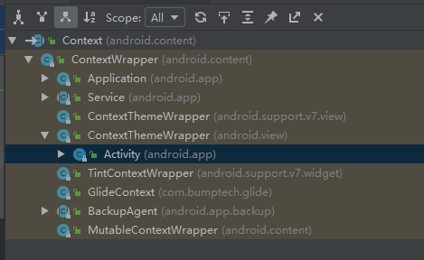

# 四大组件以及Handler学习笔记

## 1. Activity

activity在安卓中主要的作用是承载界面与交互，是app的用户最直接接触到的组件。主要用来处理UI相关的操作。

### 1.1 生命周期

Activity的生命周期涉及到四个重要的状态

|状态名称|描述
|----|----|
|活动状态|当前的Activity在栈的顶点，用户可见，并且可以获得焦点|
|暂停状态|Activity失去焦点，但是仍然可见（部分遮挡或者透明主题），但是为了用户体验系统不能杀掉这个Activity|
|停止状态|这个Activity被其他的Activity覆盖，变得不可见，系统在内存不足的情况下可以回收这个Activity|onStop|onStart|
|销毁状态|这个Activity结束，从任务栈中移除|

主要生命周期变化还是根据Activity当前上是否可见以及部分可见来判断。伴随着生命周期的变化，会调用Activity的回调方法。回调方法的调用顺序如下：

```
onCreate()->onStart()->onResume()->Activity可交互->onPause()->onStop()->onDestroy()
```

其中前后的回调方法以Activity可见为中心一一对应。

#### 1.1.1 onSaveInstanceState(Bundle)

当Activity在停止状态，因为系统的内存不足想回收这个Activity时，为了能够保存这个Activity的状态，会调用这个方法将需要保存的状态存入Bundle中，并且在后续需要重建这个Activity的时候将这个Bundle传入`onCreate(Bundle)`或者`onRestoreInstanceState(Bundle)`(**这个方法在onStart（）之后调用，此时activity已经初始化完成，再传入需要恢复的参数也许更方便**)。

### 1.2 Activity的使用

一般来说Activity的使用时需要在系统的manifest文档中注册对应的Activity。
如以下的格式

```xml
<application
        android:allowBackup="true"
        android:icon="@drawable/ic_launcher"
        android:label="@string/app_name"
        android:theme="@style/AppTheme" >
        <activity
            android:name=".MainActivity"
            android:label="@string/app_name" >
            <intent-filter>
                <action android:name="android.intent.action.MAIN" />

                <category android:name="android.intent.category.LAUNCHER" />
            </intent-filter>
        </activity>
    </application>
```

Activity应该注册在application中，其中intent-filter用来设定匹配规则用来匹配对应的隐式intent。category设定为LAUNCHER的activity为对应的启动页面。在安卓的桌面中点击图标就会唤醒这个对应的页面。

### 1.3 Activity的启动类型以及启动方法

Activity在安卓中一共有四种启动类型，启动类型决定了这个Activity在任务栈中的行为模式。安卓为了保持用户使用的连贯性，是以任务栈的形式来管理的，这个栈内启动Activity就会创建这个Activity的实例压入栈顶并显示，按下返回键则会弹出栈顶的Activity，返回到原来的Activity中。我们可以静态或者动态设置Activity的启动模式。
静态设置：在manifest文件中为Activity设置launchMode标签。
动态设置：在用Intent调用Activity的时候，设置intent的Flags位(并不是所有的启动模式都能通过动态启动)。

#### 1.3.1 standard(标准模式)

在不设置的情况下，Activity默认为标准模式，每次启动或者跳转到该Activity的时候，Activity都会创建一个新的实例并压在任务栈顶。所以如果一个Activity多次被调用，就会有多个实例。
一般在Activity调用逻辑设计够好的情况下，可以在绝大部分情况使用。

#### 1.3.2 SingleTop(栈顶复用)

当这个Activity正在当前的任务栈顶的时候，如果通过Intent跳转到还是它本身的Activity，那并不会创建一个新的实例，而是调用`onNewIntent(Intent)`方法。

#### 1.3.3 singleTask(栈内复用)

当一个activity的启动模式是singleTask的时候。如果任务栈内已经有一个这个Activity的实例，那么并不会创建新的实例，而是将intent传入这个实例，调用'onNewIntent(Intent)'方法，并到栈顶来，上面的所有任务会被弹出。
如果在任务栈A(前台)中调用任务栈B(后台)的中已有实例的Activity(SingleTask)模式，那么整个任务栈B会被拿到前台来，并且在任务栈A之上。再按下back键并不会返回到任务栈A中，而是在任务栈B中返回。


**常使用的情况：** App的主界面可以尝试使用这个模式，这样子不管打开了多少个Activity页面，回到主界面的时候，上面的所有二级界面都应该推出，这样子才不会出现在主界面按返回键而不是退出应用的情况

#### 1.3.4 singleInstance(单栈单实例)

启动模式和singleTask类似，但是这种模式下，这个Activity是这个任务栈内唯一的activity实例，通过这个activity实例打开的其他activity只会创建在一个另外的任务栈中。

#### 1.3.5 TaskAffinity属性

TaskAffinity属性设置了这个Activity所需要的任务栈的名字，默认情况下的任务栈名字为包名。
一般使用的时候需要配合`Intent.FLAG_ACTIVITY_NEW_TASK`以及`allowTaskReparenting`使用。

- 如果搭配`Intent.FLAG_ACTIVITY_NEW_TASK`使用，并且TaskAffinity值与原值不同，会创建一个新的任务栈，并加入新栈中。
- 如果搭配`allowTaskReparenting`使用，当app A调用app B 中的activity时，虽然他们不是同一个进程，但是同属一个Task。此时如果再从桌面点击B 的启动图标，在旧的任务栈中的app B的Activity会转移到B的任务栈中去。

### 1.4 Activity对应Intent的常用Flag标志以及匹配规则

#### 1.4.1 Activity对应的intent常用标志位

`FLAG_ACTIVITY_NEW_TASK`
使用一个新的Task来启动一个Activity，而且这个新的栈会在旧的任务栈的上面。
**一般在Service中启动Activity时，需要加上这个标志位，因为Service自己本身并不在一个任务栈中，所以需要创建一个新的任务栈来容纳打开的新Activity**

`FLAG_ACTIVITY_SINGLE_TOP`
这个标志位就是动态使用singleTop模式来启动一个Activity。

`FLAG_ACTIVITY_CLEAR_TOP`
使用这个标志位，如果在当前的任务栈中已经有Activity的实例，那么不会创建新的实例，而是将在任务栈上面的所有实例都推出，并且将这个intent作为一个新的intent传给这个旧实例。

`FLAG_ACTIVITY_NO_HISTORY`
如果intent设置了这个标志位，那么新的Activity不会保持在历史任务栈中。一旦用户离开了这个Activity界面，那么这个Activity就会被关闭。这个也可以在manifest中静态设置。

#### 1.4.2 IntentFilter的匹配规则

intent一般用于四大组件之间传递信息，除了显式的intent直接指定启动的对象。隐式的intent需要intentFilter来根据匹配模式进行匹配，以确定是否接受这个Intent。
intentFilter中可以设置action，category以及data三种信息，三种信息都可以有不止一个，而且一个Activity也可以设置多个intentFilter。如果一条intent想要匹配一个intentFilter。**那么三种信息都要能匹配。**

**Action:** intent可以通过`setAction()`方法设置，如果intent指定了这个Action，那么命中的IntentFilter中必须包含这个这个Action字段。intent只要与filter中的action其中一个完全匹配就能匹配成功。

**Data：**只要intent的data和filter中的一个data类型，那么就能匹配成功。
data有mimeType和uri两个类型，MineType指的是媒体Type类型，有scheme、authority、path三个部分。

- 如果intent filter中仅指定了scheme，则（Intent中）所有包含该scheme的Uri都匹配；
- 如果filter中指定了scheme,authority,无path，则（Intent中）所有相同scheme和authority的Uri都匹配。path忽略；
- 如果filter中同时指定了scheme,authority和path，则（Intent中）完全一样才能匹配。

**Category:** intent里的Category必须在filter里能找到一样的Category才能完全匹配。

## 2. Service

### 2.1 Service的生命周期

Service的生命周期主要有两种。使用前需要在manifest中进行注册。
通过startservice调用或者bindService调用，虽然Service也有后台的概念，但是Service也是运行在主线程上的(这点与Thread不同)。**所以需要注意的是，如果这个Service需要长时间占用CPU或者有阻塞主线程的操作，那么这个Service应该有自己的线程完成这个操作。**

**未绑定的Service:** 调用`startService()`即可启动服务，但是不可以进行通信。不管调用了多少次`startService()`，只会调用一次`onCreate()`，但是会调用多次`onStartConmand()`，而且只要调用一次`Context.stopService()`或者`stopself()`就会停止这个服务而不需要多次调用。

```flow
st=>start: 调用 startService()
op1=>operation: onCreate()
op2=>operation: onStartConmand()
op3=>operation: Service运行中
sp=>operation: Service被自己或
                者客户端停止了
op4=>operation: onDestroy()
ed=>end: Service 停止
st->op1->op2->op3->sp->op4->ed

```

**绑定的Service:** 绑定的Service是通过`bindService()`来进行调用，使用还需要重写`onBind()`方法，以及定义`onBind()`返回的Binder对象。client通过ServiceConnection获取Binder，就可以直接调用其中的方法，实现service与外界的通信。通过`bindService()`启动的Service，当client销毁的时候，cient会自动与Service解除绑定，如果只通过bind启动了服务，且没有和别的client绑定，那么Sevice就会自动停止。

```flow
st=>start: 调用 bindService()
op1=>operation: onCreate()
op2=>operation: onBind()
op3=>operation: 客户端与这
                个Service绑定
sp=>operation: 所有的客户端调用了
            onUnbindService()方法
ub=>operation: onUnbind()
op4=>operation: onDestroy()
ed=>end: Service Shut Down by 
            itself or a client
st->op1->op2->op3->sp->ub->op4->ed
```

### 2.2 远端Service
remote service运行在独立的进程中，这个进程可以在manifest中指定process。服务常驻在后台，不受其他的Activity的影响。但是想要和remote service通信。就需要比较复杂的跨进程通信(AIDL)。

**使用远端Service的步骤：**
- 服务Service端：
1.新建AIDL文件，并在其中定义Service需要与Activity通信的方法。
2.在Service的子类中定义AIDL种方法的实现，并定义Service的生命周期相关的方法。(`onCreate(),onStartCommand(),onDestroy(),onBind(),onUnbind()等`)
3.在Manifest中注册Service，指定为remote Service。

- 客户Client端：
1.将服务端的AIDL文件所在包复制到客户端的目录下，并进行编译
2.在Activity中使用Stub.asInterface接口获取Service的Binder
```java
private ServiceConnection connection = new ServiceConnection() {

    //重写onServiceConnected()方法和onServiceDisconnected()方法
    //在Activity与Service建立关联和解除关联的时候调用
    @Override
    public void onServiceDisconnected(ComponentName name) {
    }

    //在Activity与Service建立关联时调用
    @Override
    public void onServiceConnected(ComponentName name, IBinder service) {

        //使用AIDL_Service1.Stub.asInterface()方法获取服务器端返回的IBinder对象,AIDL_Service1是AIDL接口变量。
        //将IBinder对象传换成了mAIDL_Service接口对象
        mAIDL_Service = AIDL_Service1.Stub.asInterface(service);

        try {

            //通过该对象调用在MyAIDLService.aidl文件中定义的接口方法,从而实现跨进程通信
            mAIDL_Service.AIDL_Service();

        } catch (RemoteException e) {
            e.printStackTrace();
        }
    }
};
//bindService中使用bindService(intent)的时候,需要setPackage()指定包名
//并且使用隐式调用指定匹配的action，与Service端的action要一致,即"Service包名.aidl接口文件名"
```
3.根据需要调用服务器提供的接口方法

### 2.3 onStartConmand的返回值

onStartConmand方法必须返回一个整数，代表了系统在杀死Service的时候，应该如何继续这个服务的值。
- `START_NOT_STICKY`
如果系统在`onStartCommand()`方法返回之后杀死这个服务，那么直到接受到新的Intent对象后，这个服务才会被重新创建。这是最安全的选项，用来避免在不需要的时候运行你的服务。
- `START_STICKY`
如果系统在`onStartCommand()`返回后杀死了这个服务，系统就会重新创建这个服务并且调用`onStartCommand()`方法，但是系统会用一个null的Intent对象来调用onStartCommand()方法。需要注意处理这一种情况。
- `START_REDELIVER_INTENT`
如果系统在`onStartCommand()`返回后杀死了这个服务，那么系统会计划重启这个服务，并且传入最后的intent对象。
- `START_STICKY_COMPATIBILITY`
是START_STICK的兼容版本，返回值不能保证系统一定重新创建这个Service。


### 2.4 了解Context

Android中的Context一般用来获取资源，创建UI等等，获取Service服务等等。
在Android中的Context是一个抽象类,Service,Activity等都是Context的一个子孙类。里面声明了许多抽象方法，包括常用的startService，sendBoardcast之类的。

看继承关系可以看到，我们常用到的继承Context的子类有Application，Service，Activity等，而他们都是继承自ContextWrapper。而ContextWrapper只是Context的包装类，其中并没有具体实现，具体实现在ContextImpl中，所有实现都是调用自己的一个ContextImpl对象。下面的ContextThemeWrapper则是Activity的父类，因为Activity与UI相关，所以需要设置Theme，Service则是一个抽象类，下面分别继承了更多种的Service类。
ContextImpl在静态取注册了各种系统服务，使得所有是Context的对象都能随时通过getSystemService来获取系统服务。

## 3. Broadcast

BroadCast主要用于组件之间与进程之间的通讯，我们一般可以使用Context的`sendBoardcast(intent)`或者来`sendOrderBoardcast(intent)`发送消息。再用注册好的BroadcastReceiver中的intentfilter来匹配广播，如果匹配成功则会执行`onReceiver()`方法。BroadcastReceiver 的生命周期很短，在执行 `onReceiver()` 方法时才有效，一旦执行完毕，该BroadcastReceiver 的生命周期就结束了

### 3.1 Broadcast的分类
- 标准广播
标准广播是一种异步的广播，标准Broadcast在发出后，所有的接收器都会同时间接收到这条广播，不分先后顺序，而且无法被截断。

- 有序广播
有序广播是同步执行的广播，在广播发出后，同一时间只有一个BroadcastReceiver可以收到。根据优先级来决定先后顺序，当优先级别高的BroadcastReceiver处理完后，后面的广播才会收到，而且前面的BroadcastReceiver可以选择截断，这样子后面的BroadcastReceiver就无法收到这条广播了。

### 3.2 BroadcastReceiver的注册方式

- 静态注册
静态注册就是在manifest文件中注册这个广播接收器，并设置intent-filter。这样子的接收器不管应用本身是否在运行都可以收到这一条广播。intent需要使用setPacksge指定包名

- 动态注册
动态注册可以在代码中狗找好一个intentfilter对象，在需要注册的地方使用`Context.registerReceiver()`注册，在取消注册的地方使用，`Context.unregisterReceiver()`取消注册。这样子注册的广播受人为控制，且只有在应用开启而且已注册的时候才能收到广播。

### 3.3 本地广播

前面未经指定的广播都是全局广播，整个系统的所有应用都能收到这一条广播。为了避免这一情况，可以使用本地广播，只有应用内能收到这一条广播。本地广播是使用 LocalBroadcastManager 来对广播进行管理。

### 3.4 使用私有权限

使用动态注册广播接收器存在一个问题，即系统内的任何应用均可监听并触发我们的 Receiver。
在清单文件中为 `<receiver> `标签添加一个android:exported="false"属性，标明该Receiver仅限应用内部使用。这样，系统中的其他应用就无法接触到该Receiver了。
此外还能添加一个`<permission>`标签,设定自定义的权限，其中设定不同的 protectionLevel 有不同的权限。
|属性值|限定方式|
|---|---|
|normal|默认值。较低风险的权限，对其他应用，系统和用户来说风险最小。系统在安装应用时会自动批准授予应用该类型的权限，不要求用户明确批准（虽然用户在安装之前总是可以选择查看这些权限）|
|dangerous|较高风险的权限，请求该类型权限的应用程序会访问用户私有数据或对设备进行控制，从而可能对用户造成负面影响。因为这种类型的许可引入了潜在风险，所以系统可能不会自动将其授予请求的应用。例如，系统可以向用户显示由应用请求的任何危险许可，并且在继续之前需要确认，或者可以采取一些其他方法来避免用户自动允许
|signature|	只有在请求该权限的应用与声明权限的应用使用相同的证书签名时，系统才会授予权限。如果证书匹配，系统会自动授予权限而不通知用户或要求用户的明确批准|
|signatureOrSystem|系统仅授予Android系统映像中与声明权限的应用使用相同的证书签名的应用。请避免使用此选项，“signature”级别足以满足大多数需求，“signatureOrSystem”权限用于某些特殊情况|

## 4. ContentProvider

ContentProvider一般用于提供统一的数据访问格式，封装底层的具体实现。对于数据的使用，不需要知道数据的来源是数据库还是网络，只需要根据ContentProvider提供的数据接口操作增删查改即可。

### 4.1 ContentProvider
ContentProvider生命周期回调方法只有'onCreate()'过程，由于ContentProvider是一个抽象类，所以在使用前需要继承ContentProvider并实现增`insert(Uri,ContentValues)`，删`delete(Uri,String,String[])`，查`query(Uri, String[], String, String[], String)`，改`update(Uri, ContentValues, String, String[])`，onCreate()，getType()等六个方法。

 **Uri的结构：**ContentProvider对数据的定位需要依赖于Uri，Uri的结构在之前Intent中data的和结构也由学习到

### 4.2 ContentResolver

其他的App想要操作ContentProvider需要先获取相应的ContentResolver,再利用其来完成对应的增删查改。一个ContentResolver获取到的结果集是一个Cursor，再通过cursor的操作来获取想要的结果。

### 4.3 使用方法

1.创建一个ContentProvider继承ContentProvider类，并重写其中六个方法，并且在manifest文件中注册这个provider。
```xml
<provider
            android:name=".MyProvider" 
            android:authorities="com.example.com.testProvider"
            android:enabled="true"
            android:exported="true" />。
```
第一个参数:类名
第二个参数:通常使用包名来使用, 可以区分 不同的程序之间的内容提供器
第三个参数:启用
第四个参数:表示允许被其他的应用程序进行访问

2.在另外的程序中获取ContentProvider，通过uri指定增删查改的程序名以及表名。

## 5. Handler

Handler机制是Android中常用的跨线程通信机制。通过Handler发送以及消化Message。一般来说是不能在非主线程中更新UI的，但是在UI线程中执行耗时的操作又会阻塞UI线程，导致卡顿甚至ANR。所以我们一般在子线程中执行耗时的操作。再通过Handler机制将处理完的消息传送给UI线程更新。

### 5.1 Message、Handler、MessageQueue和Looper
这四个组成了handler机制，他们是这么一起工作的。
handler发送消息Message或者Runnable对象给MessageQueue，Looper再不停得从MessageQueue中取出消息或者任务，再送回给Handler处理这条消息。
**一个线程只有一个MessageQueue和一个Looper。**

### 5.1 使用方法

#### 5.1.1  使用Message传送信息
一般有以下这些方法：
```java
boolean sendEmptyMessage (int what)
//发送一个只有消息标识waht的空消息。
boolean sendEmptyMessageAtTime (int what, long uptimeMillis)
//在具体指定的时间uptimeMillis发送一个只有消息标识waht的空消息。
//uptimeMillis为系统开机到当前的时间（毫秒）。
boolean sendEmptyMessageDelayed (int what, long delayMillis)
//在过了delayMillis毫秒之后发送一个只有消息标识waht的空消息。
boolean sendMessage (Message msg)
boolean sendMessageAtTime (Message msg, long uptimeMillis)
//在指定的时间发送给一条消息
boolean sendMessageDelayed (Message msg, long sendMessageDelayed )
//在过一段时间后发送消息
```

#### 5.1.2 使用post Runable对象
```java
boolean post (Runnable r)
//Runnable对象会运行在生成handler的线程中。
boolean postAtTime (Runnable r, long uptimeMillis)
//在具体指定的时间uptimeMillis让Runnable运行在Handler对象被创建的线程中
boolean postDelayed(Runnable r, long delayMillis)
//在具体指定的时间delayMillis之后让Runnable运行在Handler对象被创建的线程中。
```
一般来说我们如果希望从A线程往B线程传递信息，那么应该在B线程创建这个Handler并且在A中使用取得这个Handler的引用，使用这个handler来传递消息。因为希望Handler能在多个线程中都能取得引用，那么不可能独立存在于某个线程内。存在于一个独立的线程并且是内部私有的类，其实是Looper，通过ThreadLocal保证。在开始使用handler机制的时候，需要在handler创建的线程维护一个Looper，Looper内又只有一个MessageQueue。

### 5.2 Handler机制是如何实现准时延时处理消息的

1.handler不管如何发送消息，最后都会进入到MessageQueue的enqueueMessage方法。
2.MessageQueue就是一个单向链表结构，MessageQueue就是简单的将消息按顺序放如链表中,将时间放在message的when字段中,并且只保留了头部的引用。
3.然后Looper开始loop()轮询取出MessageQueue的消息。
4.在Looper的loop()方法内，使用MessageQueue.next()方法取出消息。而在next方法中判断如果头部的这个Message是有延时而且时间未到，那么会计算一下剩下的时间，保存为nextPollTimeoutMillis，记住没有新消息来的话，线程自动唤醒的时间。然后调用`nativePollOnce(ptr, nextPollTimeoutMillis)`阻塞队列。
5.但是为了之后进入的Message不会被前面的延时消息阻塞，在新的message进入队列的时候，会根据这个message的时间计算message的位置，如果这个message会在队首，那么enqueueMessage()方法会调用nativeWake()方法唤醒线程，这样子后面进来的延时短的message就不会被前面的延时长的message阻塞了。

### 5.3 如何避免handler引起的内存泄露

handler是用来线程间通信，新开启的线程就会持有handler的引用，如果在Activity中以非静态内部类的形式创建Handler。那么内部类会持有外部类的引用，在Handler没有被回收的情况下，整个Activity都不能被释放，这就造成了内存泄露。

**解决方法：**使用静态内部类的方式创建handler。并且在handler中使用弱引用的方式持有外部Activity的引用。那么在GC的时候，弱引用持有的Activity就会自动回收。

2019.10.25
Grayson Zeng


